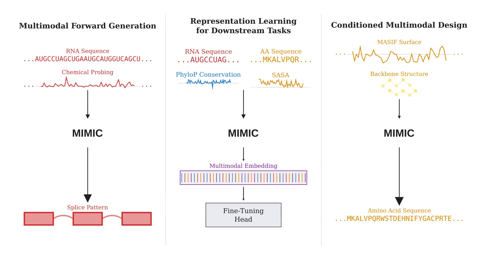
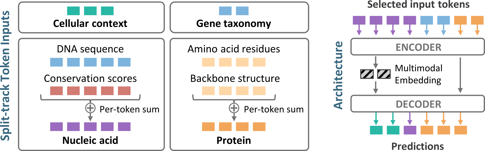
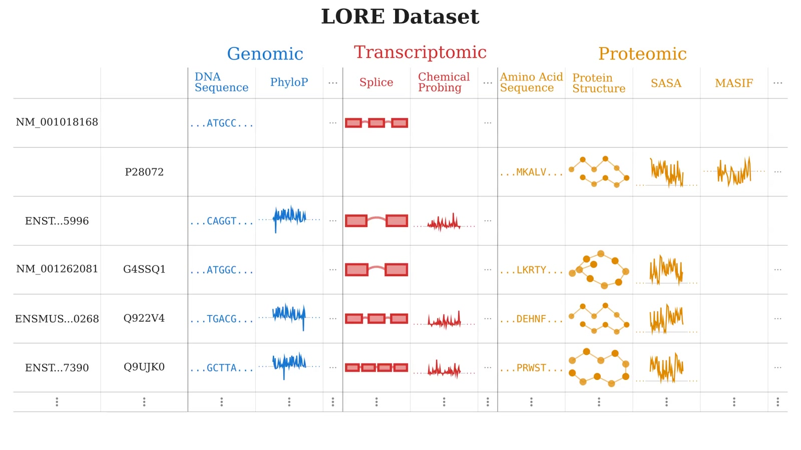

# MIMIC: A Generative Multimodal Foundation Model for Biomolecules

[](https://arxiv.org/abs/2604.24506)
[](https://polymathic-ai.org/blog/mimic/)
[](LICENSE)
[](https://huggingface.co/polymathic-ai/MIMIC)
[](https://huggingface.co/datasets/polymathic-ai/LORE-examples)

MIMIC is a generative multimodal foundation model that jointly models DNA, RNA, proteins, and cellular context in one framework.

Most biological AI systems treat sequence, structure, and function as separate tasks. MIMIC instead learns a shared distribution over molecular states, enabling any-to-any inference and design across modalities.


## Why This Matters

- Biological function emerges from coupled constraints across sequence, structure, regulation, and context.
- Single-modality models miss information that is available in complementary modalities.
- Many high-value problems are inverse problems: generate sequences that satisfy desired structural or regulatory outcomes.

## What MIMIC Does

- **Any-to-any generation:** Condition on any observed subset of modalities and infer the rest.
- **Splicing prediction and design:** Improves splice prediction and enables targeted sequence redesign under fixed constraints.
- **Protein design:** Uses multimodal conditioning (e.g., backbone + surface context) to generate diverse high-confidence binders.
- **RNA structure support:** Predicts probing-like reactivity tracks that improve downstream RNA secondary-structure inference.
- **Transfer learning:** Delivers strong performance across diverse RNA and protein downstream benchmarks.



## Installation

MIMIC requires Python 3.10+ and installs cleanly with either `pip` or [`uv`](https://docs.astral.sh/uv/).

```bash
pip install git+https://github.com/PolymathicAI/MIMIC.git
```

The base install is intentionally lightweight (`torch`, `x-transformers`, `einops`,
`numpy`, `safetensors`, `huggingface_hub`). Modality-specific extras pull heavier
dependencies only when you need them:

```bash
pip install "mimic-cd[structure] @ git+https://github.com/PolymathicAI/MIMIC.git"  # protein structure (biotite + ESM3 VQVAE)
pip install "mimic-cd[text]      @ git+https://github.com/PolymathicAI/MIMIC.git"  # free-text / context (transformers / BioBERT)
pip install "mimic-cd[all]       @ git+https://github.com/PolymathicAI/MIMIC.git"  # everything
```

The project is named **`mimic-cd`** (the name `mimic` was taken), but the import
package is `mimic` — i.e. `from mimic import load_pretrained`. A PyPI release is
planned; for now install from GitHub.

Pretrained weights (`config.json` + `model.safetensors`) are hosted separately on the
[Hugging Face Hub](https://huggingface.co/polymathic-ai/MIMIC) and downloaded on demand
by `load_pretrained` — they are **not** bundled in the pip package.

## Quickstart

```python
from mimic import load_pretrained

# Downloads MIMIC 1.0 weights from the Hub on first call (cached thereafter);
# device="auto" uses CUDA if available, else CPU.
model = load_pretrained(version="1.0")

# --- Embedding: encode one or more modalities into joint representations ---
model.input([{"rna_seq": "ACGUACGUACGUACGUACGUACGU"}])
reps = model.embed(sep_encodings=False)   # {"full", "mask"/"mod_ids" (per-token group ids), "register"}

# --- Masked generation (infill): mask positions in a modality and regenerate them ---
# Masking is done on token ids, not characters (a literal "_" would tokenize to UNK,
# not the mask token): tokenize, set the positions you want filled to the mask id,
# then pass them under the `tok_` key.
rna = model.tokenizers["tok_rna_seq"]
ids = list(rna.tokenize("ACGUACGUACGUACGUACGUACGU"))
ids[8:16] = [rna.mask_token_id] * 8                 # mask an 8-nt stretch
model.input([{"tok_rna_seq": ids}])
out = model.generate("rna_seq")                     # default strategy = Ensemble
print(out["rna_seq"])                               # "ACGU..." — the 8 nucleotides filled in

# --- Any-to-any generation: condition on one modality, generate another ---
model.input([{"rna_seq": "ACGUACGUACGUACGUACGUACGU"}])
out = model.generate("splice_jctns_5cls")           # RNA -> per-position splice sites
print(out["splice_jctns_5cls"])                     # one site-type class per position

# generate() returns the detokenized prediction by default; pass return_tokens /
# return_logits / return_probs / return_sampling_probs to also get the raw arrays
# (each value then becomes a dict with "preds" plus the requested extras).
```

`generate` also accepts `strategy="one_shot"` or `"autoregressive"` (or a
`mimic.strategies` instance), and multiple targets at once. See
[`docs/generation.md`](docs/generation.md) for the full output format and pathway
gating, and [`src/mimic`](src/mimic) for the rest of the API.

## Architecture at a Glance

- ~1.25B parameter encoder-decoder transformer
- Split-track multimodal representation (nucleic acid, protein, semantic context, etc.)
- Localized positional encoding within each track
- Register-token compression for global molecular context
- Multi-pathway training for partially observed modality combinations
- Curriculum scaling of context length (1k to 10k tokens)



## LORE Dataset (Training Backbone)

LORE aligns heterogeneous molecular data into coherent, partially observed examples with shared transcript/protein anchors.

Scale highlights:
- 13M RNA transcripts
- 15.5M proteins
- 4B+ natural language tokens
- 6000+ organisms



## Links

- **Paper:** [arXiv:2604.24506](https://arxiv.org/abs/2604.24506)
- **Blog post:** [MIMIC announcement and technical overview](https://polymathic-ai.org/blog/mimic/)

## Open Source Status

- **Code / package:** this repository (MIT) — `pip install git+https://github.com/PolymathicAI/MIMIC.git` (`mimic-cd`; PyPI release planned).
- **Weights:** [`polymathic-ai/MIMIC`](https://huggingface.co/polymathic-ai/MIMIC) on the Hugging Face Hub.
- **Example data:** [`polymathic-ai/LORE-examples`](https://huggingface.co/datasets/polymathic-ai/LORE-examples).

## Citation

If you use this work, please cite:

```bibtex
@misc{golkar2026mimicgenerativemultimodalfoundation,
      title={MIMIC: A Generative Multimodal Foundation Model for Biomolecules}, 
      author={Siavash Golkar and Jake Kovalic and Irina Espejo Morales and Samuel Sledzieski and Minhuan Li and Ksenia Sokolova and Geraud Krawezik and Alberto Bietti and Claudia Skok Gibbs and Roman Klypa and Shengwei Xiong and Francois Lanusse and Liam Parker and Kyunghyun Cho and Miles Cranmer and Tom Hehir and Michael McCabe and Lucas Meyer and Rudy Morel and Payel Mukhopadhyay and Mariel Pettee and Helen Qu and Jeff Shen and David Fouhey and Hadi Sotoudeh and Vikram Mulligan and Pilar Cossio and Sonya M. Hanson and Alisha N. Jones and Olga G. Troyanskaya and Shirley Ho},
      year={2026},
      eprint={2604.24506},
      archivePrefix={arXiv},
      primaryClass={cs.AI},
      url={https://arxiv.org/abs/2604.24506}, 
}
```

## License

This project is licensed under the [MIT License](LICENSE).
